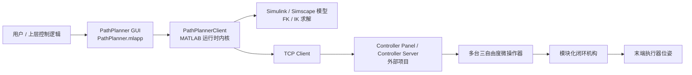
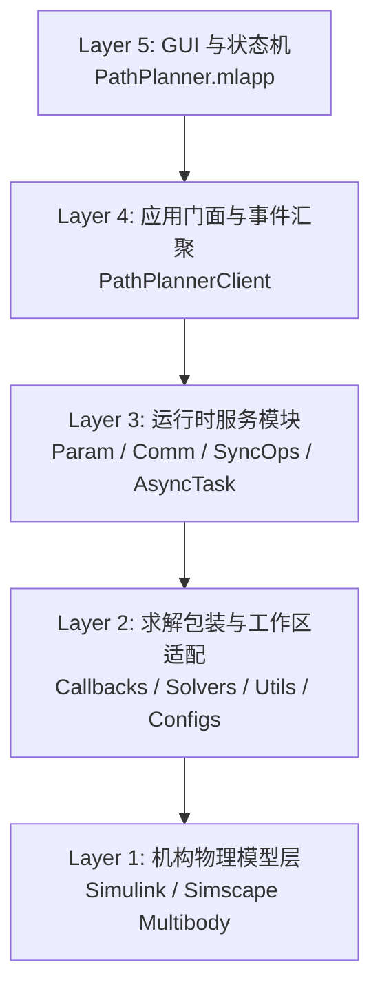
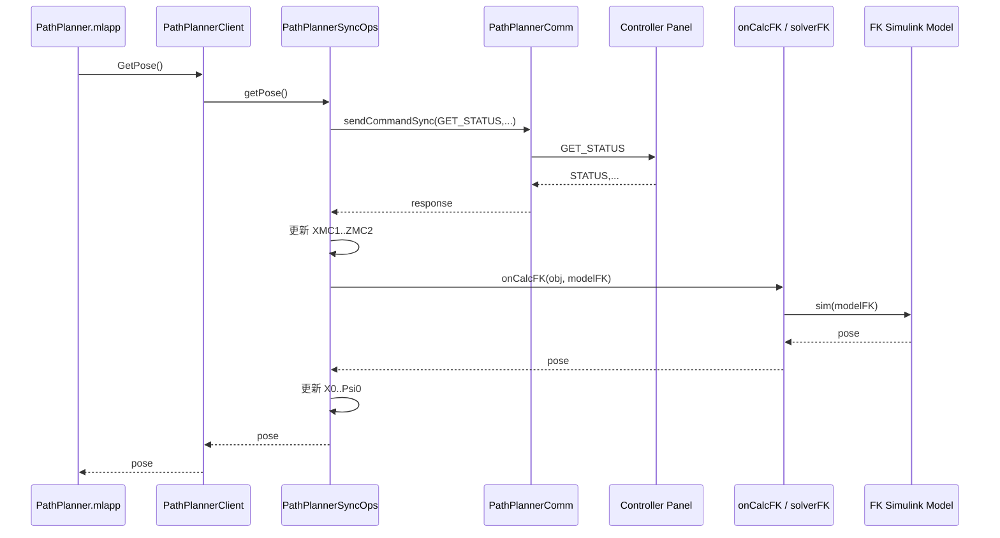
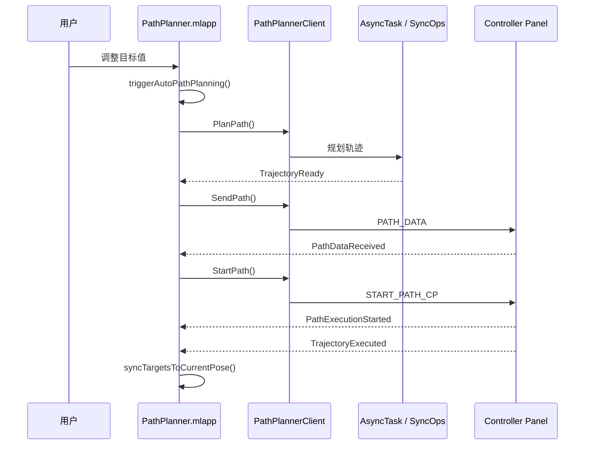
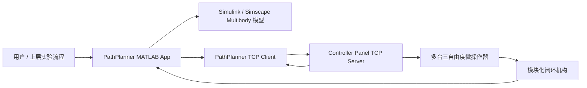
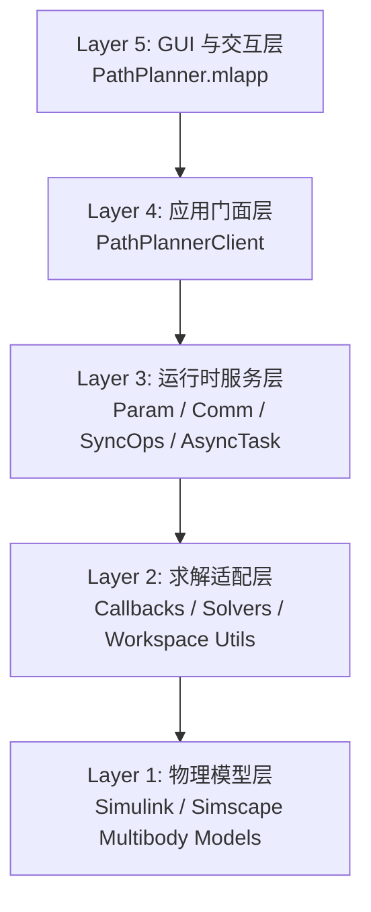
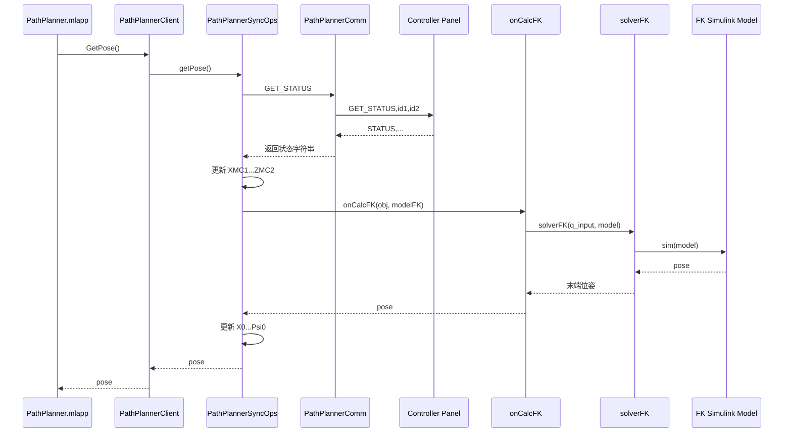

# PathPlanner 项目说明与架构梳理

## 1. 文档定位

这份文档用于系统性说明整个 PathPlanner 项目的目标、架构、运行链路、核心模块职责与维护边界，为后续迭代提供一份以源码行为为准的中文版参考。

- `README.md` 主要描述一个典型模块化机构案例和基本使用背景。
- `api_specification.md` 主要描述 PathPlanner 与下游 Controller Panel 之间的 TCP 通信协议。
- 本文档重点回答以下问题：
  - PathPlanner 在整个控制系统中的角色是什么。
  - 代码按什么层次组织，哪些模块是核心，哪些是辅助。
  - 正逆运动学、路径规划、轨迹下发和执行反馈如何串成一条完整控制链。
  - 新的模块化机构模型接入时，需要满足哪些软件契约。

本文以仓库当前源码的实际实现为主，同时结合项目的设计意图进行解释。当设计意图、协议文档和当前实现之间存在演进痕迹时，应以源码为主，再反向修订文档与协议说明。

---

## 2. 项目使命与系统角色

PathPlanner 不是一个直接驱动电机的底层控制器，而是整个模块化闭环微操作系统中的最上层运动学与轨迹规划节点。

项目要解决的问题是：

1. 模块化机构本体由无动力标准体素模块拼装而成，模块之间通过磁力连接形成多种闭环拓扑。
2. 机构本身没有主动关节驱动，必须由多台外部微操作器牵引机构上若干挂载点。
3. 单台微操作器通常只能提供平移自由度，但多台驱动器通过专门设计的非同步轨迹，可以诱发机构内部被动旋转关节转动，从而让末端执行器获得额外姿态自由度。
4. 因此，系统必须打通“机构描述 -> 正逆运动学解算 -> 驱动器位移轨迹 -> 控制器执行 -> 状态回传”的完整链路。

PathPlanner 在这个链路中的职责可以概括为两类：

- 正运动学：根据 Controller Panel 返回的多台微操作器当前位置，计算模块化闭环机构当前末端位姿。
- 逆运动学：根据用户指定的目标末端位姿，计算牵引机构的多台微操作器应该执行的位移轨迹。

这意味着 PathPlanner 的核心不是 UI，也不是 TCP 通信本身，而是“基于 Simulink / Simscape Multibody 的模型驱动运动学求解”。其余代码主要是在为这条求解链路提供运行时编排、配置管理、通信封装和可视化界面。

---

## 3. 系统上下文

从整体控制架构看，PathPlanner 与下游 Controller Panel 是两个解耦的软件节点：



其中：

- PathPlanner 负责“算什么轨迹”和“根据当前位置推算机构位姿”。
- Controller Panel 负责“把轨迹点转换成实际微操作器连续运动”并返回硬件状态。
- 两者之间通过纯文本 TCP 协议通信，风格类似轻量 REST，但实际载体是逗号分隔的命令字符串。

从实现风格看，这是一套“系统级微服务化 + 进程内模块化”的混合架构：

- 系统级：PathPlanner 与 Controller Panel 是分离进程、分离职责的两个节点。
- 进程内：PathPlanner 内部并不是一坨脚本，而是由多个职责单一的 MATLAB 类协作完成。

---

## 4. 顶层目录与职责划分

下面按功能而不是按文件逐个列举的方式概括仓库主干：

```text
PathPlanner/
|-- PathPlanner.mlapp              # App Designer GUI 主界面
|-- README.md                      # 简版项目说明
|-- api_specification.md           # 与 Controller Panel 的 TCP 协议说明
|-- configs/                       # 函数式配置文件
|   |-- comm_params.m
|   |-- controller_params.m
|   |-- robot_params.m
|   `-- sim_params.m
|-- src/
|   |-- Callbacks/                 # GUI 回调与求解流程包装
|   |-- Models/                    # Simulink / Simscape Multibody 模型
|   |-- Servers/                   # PathPlannerClient 与运行时内核模块
|   |   |-- PathPlannerClient.m
|   |   |-- Core/
|   |   `-- Events/
|   |-- Solvers/                   # FK / IK 求解入口
|   |-- Utils/                     # 配置和工作区管理工具
|   |-- Analysis/                  # 工作空间分析脚本
|   `-- Vision/                    # 视觉测量与 ArUco 试验脚本
|-- test/                          # FK / IK 快速验证脚本
`-- data/                          # 导出或缓存的轨迹数据
```

可以把这些目录分成三类：

### 4.1 核心运行链路

- `PathPlanner.mlapp`
- `src/Servers/`
- `src/Callbacks/`
- `src/Solvers/`
- `src/Models/`
- `configs/`
- `src/Utils/`

这几部分共同构成了真实运行时中“连接 -> 求姿态 -> 规划 -> 下发 -> 执行”的完整控制闭环。

### 4.2 验证与分析工具链

- `test/`
- `src/Analysis/`

这部分不参与主运行时，但对新模型接入、工作空间评估和快速验证非常关键。

### 4.3 扩展性外围功能

- `src/Vision/`

视觉模块当前更偏实验性与辅助性，并未直接并入主控制链路。

---

## 5. PathPlanner 内部五层架构

PathPlanner 内部可以理解为五层结构，而不是单纯的“App + 脚本”。



### 5.1 Layer 1: 机构物理模型层

对应目录：`src/Models/`

这一层用 Simscape Multibody 中的刚体、关节、变换和约束来描述模块化闭环机构本身。

它表达的是：

- 模块如何连接。
- 哪些位置是外部驱动器的挂载点。
- 末端执行器与机构内部构件之间是什么关系。
- 机构在输入位移或目标位姿作用下，几何约束如何闭合。

这一层是整个项目最核心的“机构知识载体”。

### 5.2 Layer 2: 求解包装与工作区适配层

对应目录：

- `src/Solvers/`
- `src/Callbacks/`
- `src/Utils/`
- `configs/`

这一层做两件事：

1. 把上层的“当前位姿 / 目标位姿 / 驱动器位移”转换成 Simulink 模型能消费的输入。
2. 把 Simulink 的输出重新整理成上层运行时需要的数据结构。

由于 MATLAB / Simulink 强依赖 base workspace，这一层还承担了配置导出和工作区清理职责。

### 5.3 Layer 3: 运行时服务模块层

对应目录：`src/Servers/Core/`

这层是 PathPlanner 的内部业务核心，负责：

- 参数单一真源管理。
- TCP 通信。
- 状态查询与 FK 触发。
- 路径规划、轨迹缓存、下采样、下发与执行监控。

### 5.4 Layer 4: 应用门面与事件汇聚层

对应文件：`src/Servers/PathPlannerClient.m`

这一层对上只暴露一个统一的客户端接口，把内部多个模块封装成一个“前台看起来像单类对象”的门面。

它的作用是：

- 让 GUI 代码只依赖一个对象。
- 维护向后兼容的事件接口。
- 统一协调 Param、Comm、SyncOps、AsyncTask 之间的依赖关系。

### 5.5 Layer 5: GUI 与状态机层

对应文件：`PathPlanner.mlapp`

这一层负责：

- 用户输入目标位姿。
- 触发连接、求姿态、规划、发送、执行等操作。
- 绘制双微操作器轨迹图。
- 显示当前位姿与目标位姿坐标系。
- 用事件驱动方式维护按钮可用状态。
- 在自动模式下，将“改目标值”直接串联成“规划 -> 下发 -> 执行”。

---

## 6. 运行时主流程

## 6.1 启动流程

PathPlanner App 启动后，`startupFcn` 会完成以下初始化：

1. 把目标位姿编辑框初始化为当前 App 属性值。
2. 创建 `PathPlannerClient` 实例。
3. 从 `PathPlannerClient` 中取出共享参数对象 `app.param`。
4. 绑定事件监听器：
   - `StatusUpdate`
   - `TrajectoryReady`
   - `PathDataReceived`
   - `TrajectoryExecuted`
   - `ConnectionStateChanged`
   - `PathExecutionStarted`
   - `PathExecutionFailed`
5. 将 UI 状态设置为 `Idle`。
6. 初始化位姿可视化面板。

这意味着 App 启动后并不会立即连接控制器，而是先完成一套完整的事件驱动前端骨架。

## 6.2 连接控制器流程

连接操作通过 `PathPlannerClient.connect()` 进入 `PathPlannerComm.connect()`：

1. 使用 `tcpclient` 根据配置中的 IP、端口和超时参数建立连接。
2. 启动定时器形式的消息监听器。
3. 发送 `HEARTBEAT` 做连通性确认。
4. 若成功，则向上发布连接成功事件；若失败，则进入自动重连逻辑。

这里 PathPlanner 只扮演 TCP 客户端，下游真正提供服务的是 Controller Panel。

## 6.3 获取当前机构位姿流程

“获取当前位姿”不是直接从控制器读取末端姿态，而是先拿驱动器位置，再本地做一次 FK：



这条链说明了项目的一个关键思想：

- 控制器只知道“驱动器在哪里”。
- 机构位姿由 PathPlanner 通过 FK 模型自己推出来。

## 6.4 轨迹规划流程

点击 `Plan` 按钮后，App 会：

1. 从模型下拉框取基础名字，例如 `model_3T2R_Pitch_Roll`。
2. 自动拼接出：
   - `model_3T2R_Pitch_Roll_FK`
   - `model_3T2R_Pitch_Roll_IK`
3. 更新参数对象中的模型名。
4. 把目标平移值从 UI 的毫米输入转换为运行时使用的米。
5. 把目标姿态角写入参数对象。
6. 调用 `PathPlannerClient.PlanPath()`。

随后进入 `PathPlannerAsyncTask.planPath()`：

1. 先调用 `syncOps.getPose()` 刷新当前位置。
2. 调用 `onCalcIK()` 生成从当前位姿到目标位姿的插值轨迹。
3. `onCalcIK()` 内部会：
   - 通过 `ConfigManager` 读取 `robot / simulation / controller` 配置。
   - 通过 `WorkspaceManager` 导出这些参数到 base workspace。
   - 调用 `generateTrajectory()` 生成笛卡尔位姿轨迹。
   - 调用 `solverIK()` 运行 Simulink 模型。
4. `solverIK()` 返回两台驱动器的位移轨迹 `qData`。
5. `planPath()` 再根据姿态变化量和位移变化量估计需要保留的轨迹点数，并对结果做动态下采样。
6. 最终把轨迹缓存到 `lastTrajectoryData`，并触发 `TrajectoryReady` 事件。

这里的设计重点不是“直接推公式”，而是“通过模型仿真把任意闭环机构描述变成可复用求解器”。

## 6.5 轨迹发送流程

点击 `Send` 按钮后，`PathPlannerAsyncTask.sendPath()` 会：

1. 检查当前是否已连接且确实存在已规划轨迹。
2. 将缓存的 6 列位移数据拆成两组 3 列：
   - `[x1, y1, z1]`
   - `[x2, y2, z2]`
3. 按控制器 ID 分别构造 `PATH_DATA` 命令。
4. 逐个同步发送并等待 `PATH_DATA_RECEIVED` 确认。

这表明当前实现并不是一次性把所有驱动器数据打成一个大包发出去，而是按驱动器逐个发送与确认。

## 6.6 执行轨迹流程

点击 `Start` 按钮后，`PathPlannerAsyncTask.startPath()` 会：

1. 从参数对象读取路径执行间隔 `interval`。
2. 默认构造 `START_PATH_CP` 命令并发送给控制器。
3. 将执行状态切换为 `isExecuting = true`。
4. 等待异步消息监听器捕捉执行开始、完成或失败通知。

控制器返回的异步消息由 `PathPlannerComm` 统一读取后，再广播给订阅者：

- `PathPlannerSyncOps` 负责处理状态相关消息。
- `PathPlannerAsyncTask` 负责处理轨迹相关消息。

## 6.7 自动模式流程

自动模式是 App 层的一个关键体验特性。其逻辑不是额外发明一套新协议，而是把现有的手动按钮流程串起来：

在用户把 Automatic Mode 开关拨到 `On` 时，App 会先调用 `syncTargetsToCurrentPose()`，把目标输入框与当前真实机构位姿对齐，再进入后续自动规划流程。这一步的目的，是避免自动模式从“陈旧目标值”起跳。



自动模式的核心收益是：

- 用户只需要改目标位姿。
- 系统自动完成规划、发送和执行。
- 运动完成后再把“目标值”同步回“当前真实位姿”，避免下一次操作发生跳变。

---

## 7. 关键源码模块详解

## 7.1 `PathPlanner.mlapp`：事件驱动前端

App 不是一个薄壳，它内部实现了一个明确的 UI 状态机：

- `Idle`
- `Disconnected`
- `Connected`
- `TrajectoryPlanned`
- `TrajectorySent`
- `Executing`
- `ExecutionComplete`

这个状态机决定了各按钮的启用/禁用关系。例如：

- 连接成功前，不能 `GetPose`、`Plan`、`Send`、`Start`。
- 规划完成后，才能 `Send` 和 `ExportPath`。
- 数据发送完成后，才能 `Start`。
- 执行过程中禁止断开连接和重复规划。

App 层还承担以下职责：

- 目标位姿输入管理。
- 左右微操作器 ID 选择。
- 模型族选择。
- 通信日志展示。
- 轨迹曲线绘图。
- 当前位姿 / 目标位姿三维坐标系可视化。
- 自动模式编排。
- 轨迹 CSV 导出。

值得注意的是，模型下拉框采用“基础模型名 + `_FK` / `_IK` 后缀”的命名约定。这意味着接入新机构时，不只是要创建模型文件，还要遵守这个命名规则，才能直接被 UI 驱动。

## 7.2 `src/Servers/PathPlannerClient.m`：门面对象

`PathPlannerClient` 是整个运行时的统一入口，采用的是典型的 Facade 模式。

它内部持有四个核心模块：

- `param`
- `comm`
- `syncOps`
- `asyncTask`

对外暴露的方法主要有：

- `connect()`
- `disconnect()`
- `GetStatus()`
- `GetPose()`
- `PlanPath()`
- `SendPath()`
- `StartPath()`
- `sendHeartbeat()`
- `isTrajectoryReady()`
- `getLastTrajectoryData()`
- `getParameterSummary()`

它最重要的意义不是自己“做很多事”，而是：

- 负责依赖装配。
- 负责事件转发。
- 让 UI 层始终只面对一个对象。

## 7.3 `src/Servers/Core/PathPlannerParam.m`：参数单一真源

`PathPlannerParam` 是整个系统的 Single Source of Truth。

它统一保存三类数据：

### A. 当前机构状态

- `X0, Y0, Z0`
- `Phi0, Theta0, Psi0`

### B. 当前目标位姿

- `XTarget, YTarget, ZTarget`
- `PhiTarget, ThetaTarget, PsiTarget`

### C. 当前微操作器状态与运行参数

- `XMC1..ZMC2`
- `interval`
- `controllerHost`
- `controllerPort`
- `manipulatorID1`
- `manipulatorID2`
- `modelFK`
- `modelIK`

它的作用不是简单存值，而是：

- 从 `ConfigManager` 启动加载配置。
- 将经常访问的配置提升为公共属性。
- 提供统一 `getParam()` / `setParam()` 接口。
- 让 Comm、SyncOps、AsyncTask 共享一份实时可变状态。

这避免了各模块分别持有一份自己的配置副本，减少状态漂移。

## 7.4 `src/Servers/Core/PathPlannerComm.m`：通信基础设施

`PathPlannerComm` 专门负责 TCP 通信问题，而不碰运动学求解。

它的核心能力包括：

- 建立与断开 `tcpclient` 连接。
- 发送同步命令并等待响应。
- 发送异步命令并由定时器后台监听回包。
- 心跳检测。
- 自动重连。
- 将收到的字符串消息重新发布成事件。

这是一个很清晰的“基础设施模块”，业务层并不直接操作 `tcpclient`。

## 7.5 `src/Servers/Core/PathPlannerSyncOps.m`：状态桥接与 FK 触发器

`PathPlannerSyncOps` 连接了“控制器返回的驱动器状态”和“本地 FK 模型求出来的机构位姿”。

它主要做三类事：

1. `getStatus()`：向 Controller Panel 请求驱动器当前位置，并更新 `param.XMC1..ZMC2`。
2. `getPose()`：在刷新驱动器位置后，调用 FK 求解，更新 `param.X0..Psi0`。
3. `stepMove()` / `stepMoveBatch()`：发送简单步进运动命令。

可以把它理解为“物理世界 -> 参数世界 -> FK 世界”的桥。

## 7.6 `src/Servers/Core/PathPlannerAsyncTask.m`：轨迹生命周期管理器

这是 PathPlanner 运行时里最像“应用服务核心”的模块。

它负责整个轨迹生命周期：

1. 规划：调用 IK。
2. 缓存：保存最近一次轨迹结果。
3. 下采样：根据目标变化量控制发送点数。
4. 发送：把轨迹拆分后发给控制器。
5. 启动：发送执行命令。
6. 监听：等待控制器回传执行开始、完成或失败。

它同时定义了多个事件：

- `TrajectoryReady`
- `TrajectoryExecuted`
- `PathDataReceived`
- `PathExecutionStarted`
- `PathExecutionFailed`

这些事件直接驱动 App 的状态转换。

代码里还预留了 PTP 相关字段（例如 `isPTPMode`、`ptpDeltas`），说明架构层面已经考虑过点到点执行分支，但当前默认主路径仍然是轨迹规划 + `START_PATH_CP` 的连续路径模式。

## 7.7 `src/Servers/Events/PathPlannerEventData.m`：标准事件载荷

该类定义了模块间统一的事件数据结构，字段包括：

- `Message`
- `Success`
- `Data`
- `Timestamp`

这使得各模块之间不需要各自发散出不同的事件参数格式，前端日志记录和状态处理也因此被统一。

## 7.8 `src/Callbacks/`：对 GUI 友好的求解包装层

这一层不是重复求解器逻辑，而是做“适合 App 调用的流程封装”：

- `onCalcFK.m`
  - 导出配置到 base workspace。
  - 收集两台驱动器位移。
  - 调用 `solverFK()`。
  - 清理工作区。

- `onCalcIK.m`
  - 导出配置。
  - 读取当前位姿与目标位姿。
  - 生成笛卡尔插值轨迹。
  - 调用 `solverIK()`。
  - 清理工作区。

- `onPlotTrajectory.m`
  - 将轨迹绘制到两个坐标轴上，分别显示左右微操作器位移曲线。

- `onVisualizePose.m`
  - 绘制世界坐标系、当前工具坐标系和目标工具坐标系。

## 7.9 `src/Solvers/`：真正的 FK / IK 入口

这两个文件是 Simulink 模型的直接软件适配器：

- `solverFK.m`
- `solverIK.m`

它们的职责是：

- 保证模型被加载。
- 构造模型输入。
- 设置仿真参数。
- 运行 `sim(model)`。
- 从 `simOut` 中提取 `pose` 或 `q`。

它们不是通用数学求解器，而是“Simulink 模型的标准执行壳”。

## 7.10 `src/Utils/`：配置与工作区适配

### `ConfigManager.m`

这是一个函数式配置加载器 + 单例缓存器：

- 配置不采用 JSON 或 YAML，而是 `configs/*.m` 返回结构体。
- `ConfigManager` 负责调用这些函数、缓存结果并提供查询接口。
- 还可以把配置导出到 base workspace，供 Simulink 模型读取。

### `WorkspaceManager.m`

这个类解决了一个典型 MATLAB 工程问题：

- Simulink 模型需要 base workspace 变量。
- 但反复往 base workspace 注入变量，会污染用户环境。

因此它负责：

- 记录导出前已有变量。
- 跟踪导出的配置变量。
- 在求解结束后只清理配置相关变量，而不误删用户变量。

这是一个非常实用的工程化补丁，也是本项目能把“仿真模型”稳定嵌入“可交互应用”的关键原因之一。

---

## 8. Simulink 模型契约

PathPlanner 之所以能够支持不同模块化机构，不是因为它有一套通吃所有构型的手工公式，而是因为它约定了“模型输入输出接口”。

接入新机构时，最重要的不是复制脚本，而是满足以下契约。

## 8.1 IK 模型契约

逆运动学模型需要满足：

- 模型名遵循 `<BaseName>_IK`。
- 模型能读取 base workspace 中名为 `pose` 的时序输入。
- `pose` 的每一行代表一帧目标末端位姿。
- 模型输出通过 `To Workspace` 写出名为 `q` 的结果。
- `q` 应为 `N x 6` 数据，表示两台三自由度微操作器的位移轨迹。

## 8.2 FK 模型契约

正运动学模型需要满足：

- 模型名遵循 `<BaseName>_FK`。
- 模型能读取 base workspace 中名为 `q_input` 的输入。
- `q_input` 为 1 x 6 或对应时序格式，表示两台微操作器当前位置。
- 模型输出通过 `To Workspace` 写出名为 `pose` 的结果。
- `pose` 应为 1 x 6 末端位姿向量。

## 8.3 当前可见模型族

仓库当前可见的模型文件至少包括：

- `model_3T1R_Roll_FK.slx`
- `model_3T1R_Roll_IK.slx`
- `model_3T2R_Pitch_Roll_FK.slx`
- `model_3T2R_Pitch_Roll_IK.slx`
- `mrex_hypercube_modules.slx`

App 的模型下拉框中还预留了其他基础名字，例如 `model_3T2R_Roll_Yaw`、`model_3T3R_Yaw_Pitch_Roll`。这说明界面已经按模型族扩展设计，但仓库当前未见对应 `.slx` 文件，因此这些更适合视为扩展预留项，而不是现成可用能力。

---

## 9. 配置体系

PathPlanner 当前使用函数式配置文件，而不是文本配置文件。

## 9.1 配置分类

### `configs/comm_params.m`

负责通信参数，例如：

- 控制器 IP / 端口
- 连接超时
- 响应超时
- 自动重连策略
- 协议版本

### `configs/controller_params.m`

负责控制器相关参数，例如：

- 两台微操作器 ID
- 初始位置
- 分辨率
- 控制频率
- 滤波与回零参数

### `configs/robot_params.m`

负责机构与安全边界参数，例如：

- 标准体素尺寸
- 末端针尖相关几何量
- 工作空间边界
- 角度极限
- 软限位 / 碰撞检测开关

### `configs/sim_params.m`

负责仿真与模型参数，例如：

- `simTime`
- `timeStep`
- 默认 `modelFK / modelIK`
- 初始位姿
- 可视化与日志设置

## 9.2 配置加载路径

配置加载流程是：

1. `PathPlannerParam` 启动时调用 `ConfigManager.getInstance()`。
2. `ConfigManager.loadAllConfigs()` 依次调用四个配置函数。
3. `PathPlannerParam.loadParametersFromConfig()` 把常用参数复制到公共属性。
4. 求解时，再通过 `WorkspaceManager.smartExportConfig()` 把需要的配置导出到 base workspace。

这个设计兼顾了两件事：

- 运行时读取方便。
- Simulink 模型兼容性不被破坏。

---

## 10. 数据结构与单位约定

本项目的单位体系有明显的“跨层转换”特征，维护时必须特别留意。

## 10.1 位移量

- 控制器协议层：通常按微米传输。
- App 输入层：目标平移量以毫米输入显示。
- FK / IK 求解层：求解器接口以米为主要数值单位。
- 轨迹导出层：CSV 的列结构按控制器位移语义组织，列名使用 `_um` 约定，目标是与控制器侧位移数据语义保持一致。

## 10.2 姿态角

当前代码中姿态角存在“注释约定与运行时习惯并存”的历史痕迹：

- App 输入与可视化流程按角度值处理。
- `onVisualizePose.m` 在绘图前显式调用 `deg2rad()`。
- 某些配置注释又把 `Phi0 / Theta0 / Psi0` 标为弧度。

因此，对维护者最稳妥的理解是：

- 平移单位链路相对清晰。
- 姿态角单位必须结合具体模型的输入约定逐段核对，不能只看注释。

## 10.3 关键数据结构

### 轨迹输入结构 `trajectoryData`

用于 IK：

- `poses`: `N x 6` 位姿序列
- `time`: `N x 1` 时间向量
- `dt`: 采样周期

### 轨迹缓存结构 `lastTrajectoryData`

用于发送与导出：

- `id1`, `id2`
- `qTime`
- `qData`
- `elapsedTime`

### 驱动器位移向量

当前默认结构固定为 6 列：

`[x1, y1, z1, x2, y2, z2]`

这说明当前 PathPlanner 的核心数学与数据结构都建立在“两个三自由度微操作器牵引一个机构”的前提上。

---

## 11. 设计模式与工程思想

虽然这是一个 MATLAB 项目，但它并不是随意堆脚本，内部实际上有比较清楚的工程化思想。

### 11.1 Facade 模式

`PathPlannerClient` 统一封装内部多个模块，屏蔽复杂度。

### 11.2 Observer 模式

模块间广泛使用 MATLAB 事件与监听器通信，UI 不主动轮询底层状态。

### 11.3 Singleton 模式

`ConfigManager` 采用单例，避免多个地方各自维护配置缓存。

### 11.4 Adapter 模式

`solverFK / solverIK` 与 `WorkspaceManager` 本质上是在把 Simulink 模型适配成可编程调用的服务。

### 11.5 Single Source of Truth

`PathPlannerParam` 让当前状态、目标状态和关键配置共享同一份可变对象，减少状态漂移。

---

## 12. 测试、分析与外围能力

## 12.1 `test/`：快速模型验证

`test/FK_model_test.m` 与 `test/IK_model_test.m` 更接近“脚本化验证环境”，而不是严格意义上的自动化单元测试框架。

它们的价值在于：

- 接入新模型后快速检查 FK / IK 能否跑通。
- 验证模型输入输出变量名是否符合求解器契约。
- 为调试 Simulink 模型提供一个低门槛入口。

## 12.2 `src/Analysis/`：工作空间分析

这两个分析脚本并不参与控制主流程，但非常适合用来评估新机构设计：

- `analyze_workspace_2d_projections.m`
  - 通过扫位移与角度，分析二维投影可达区域。

- `analyze_workspace_xy_coupling.m`
  - 通过蛇形扫描和 IK 反解，分析 X-Y-角度耦合的三维工作空间边界。

这说明项目不只是“能控制”，还尝试把机构设计评估也纳入同一套求解基础设施。

## 12.3 `src/Vision/`：视觉实验支线

视觉目录当前主要包含：

- ArUco 标记识别
- Basler 相机采集
- 位姿估计
- 标定数据文件

这部分目前更像未来闭环感知能力的实验场，而不是当前控制主链路的必经环节。

---

## 13. 当前实现边界与维护注意事项

为了后续维护不误判项目能力范围，这里明确列出当前代码的几个边界。

### 13.1 运行时核心默认只面向“两台三自由度微操作器”

虽然 UI 允许从 `MC1` 到 `MC4` 中选择左右控制器，但当前核心位移数据结构仍是固定 6 列，因此本质上仍是：

- 从最多 4 台可连接控制器中选出 2 台参与当前任务。
- 一次求解默认只考虑 2 台三自由度驱动器。

如果未来要扩展到三台或更多驱动器共同牵引，最先要改的不是 UI，而是：

- 位移向量结构
- FK / IK 模型契约
- `sendPath()` 序列化逻辑
- 协议格式

### 13.2 轨迹执行当前以连续路径模式为主

代码保留了 PTP 相关字段，但当前主流程默认发送 `START_PATH_CP`，因此连续路径执行是目前的主能力。

### 13.3 协议文档与代码存在版本演进痕迹

例如：

- 控制器返回的启动消息命名。
- `START_STEP` 的负载格式。
- PTP/CP 命令与事件名字。

这些地方说明协议经历过多轮演进。维护时应同步检查：

- `api_specification.md`
- `PathPlannerComm.m`
- `PathPlannerSyncOps.m`
- `PathPlannerAsyncTask.m`

### 13.4 姿态角单位必须和模型一起检查

这不是简单的“文档修正”问题，而是直接关系到：

- 插值轨迹是否正确。
- 可视化坐标系是否正确。
- 新机构模型接入后是否会产生单位错位。

---

## 14. 新机构模型接入建议流程

如果未来要支持新的模块化闭环机构，建议按下面的顺序操作，而不是先改 GUI：

1. 在 `src/Models/` 中建立一对新的 FK / IK 模型。
2. 保证模型输入输出满足当前求解器契约：
   - IK 读 `pose`，写 `q`
   - FK 读 `q_input`，写 `pose`
3. 在 `configs/sim_params.m` 中配置默认模型，或在 App 模型下拉框中加入新的基础名字。
4. 用 `test/FK_model_test.m` 和 `test/IK_model_test.m` 跑通最小验证。
5. 用 `src/Analysis/` 脚本分析工作空间与驱动器极限利用率。
6. 再去调 UI 文案、显示范围和参数输入边界。

这条顺序反映了本项目真正的重心：

- 先有机构模型与求解正确性。
- 再有运行时集成。
- 最后才是界面体验。

---

## 15. 总结

PathPlanner 的本质不是“MATLAB 做一个控制面板”，而是：

- 用 Simulink / Simscape Multibody 把模块化闭环机构描述转成可执行的正逆运动学模型。
- 用一套内聚的运行时模块把这些模型包装成可连接下游控制器的应用服务。
- 用 App Designer 提供一个事件驱动、状态可控、支持自动执行的上层操作界面。

从软件架构角度看，这个项目最有价值的地方有三点：

1. 它把“机构设计”和“控制执行”通过模型契约真正打通了。
2. 它把 MATLAB 传统脚本式求解，整理成了带门面、事件、配置和状态机的工程化结构。
3. 它为后续扩展更多模块化机构类型保留了清晰的接入边界。

如果后续继续演进，这份项目指南应与源码同步维护，尤其要优先跟踪以下变化：

- 新增或替换的机构模型族。
- TCP 协议字段变化。
- 驱动器数量从 2 台向更多台扩展。
- 视觉感知是否正式进入主控制闭环。# PathPlanner 项目说明与架构梳理

## 1. 文档定位

本文档用于系统性说明整个 PathPlanner 项目的设计目标、代码结构、运行机制与扩展方式。

- [README.md](README.md) 主要描述一种代表性模块化机构的建模背景与基本使用意图。
- [api_specification.md](api_specification.md) 主要描述 PathPlanner 与下位控制节点之间的 TCP 文本协议。
- 本文档聚焦于“整个软件系统如何组织、如何运行、各层之间如何协作、每个模块为什么这样设计、接入新机构模型时应该改哪里”。

本指南以仓库中的实际源码行为为准。若 README、协议文档与代码实现之间存在历史版本差异，应优先复核源码。

---

## 2. 项目使命与问题背景

PathPlanner 面向一种被动式、模块化、闭环机构的微操作系统。

该机构的基本特点是：

- 机构由标准体素化模块拼装而成，模块可分为结构模块、关节模块等类型。
- 模块之间通过磁力连接，因此可以快速重构出多种不同拓扑的机构。
- 模块本身不带执行器，属于“无源机构”。
- 机构的运动来自多台外部微操作器对挂载点的牵引。
- 外部微操作器通常只提供平移自由度，例如每台驱动器只有 XYZ 三个方向的位移能力。
- 当多个驱动器按专门设计的非同步轨迹协同运动时，闭环机构内部的旋转关节会被动产生姿态变化，从而让机构末端获得超出单台驱动器原始自由度上限的附加旋转自由度。

因此，这类系统真正困难的部分不在于“把电机动起来”，而在于打通下面这条链路：

1. 用物理模型描述某种模块化构型。
2. 用正运动学把“驱动器当前位置”映射为“机构当前位姿”。
3. 用逆运动学把“机构目标位姿”映射为“多台驱动器应走的轨迹”。
4. 把这些轨迹点传给真实控制器，驱动硬件平滑执行。

PathPlanner 就是这条链路最上层的“运动学求解与轨迹生成节点”。

---

## 3. 在整体控制架构中的角色

从系统级视角看，PathPlanner 并不是直接驱动电机的下位机，而是一个位于上层的运动学与路径规划节点。它与 Controller Panel 共同构成分布式控制架构中的两个关键软件端点：

- `Controller Panel`
  负责真实三自由度微操作器的连接、状态查询、路径缓存与物理执行。
- `PathPlanner`
  负责模块化闭环机构的正逆运动学求解、轨迹生成、轨迹可视化、参数管理，以及把求解结果通过 TCP 下发给 Controller Panel。

系统级关系可以概括为：



其中：

- `PathPlanner` 关注“应该怎么动”。
- `Controller Panel` 关注“硬件是否能按要求动起来”。
- `Simulink/Simscape` 提供机构构型与运动学关系的模型表达能力。

这意味着 PathPlanner 的本质不是一个普通 GUI 工具，而是一个“基于模型的运动学求解服务 + 交互式前端”。

---

## 4. 顶层目录与职责划分

下面按职责而不是按文件逐一罗列，对仓库主干进行归纳：

```text
PathPlanner/
|-- PathPlanner.mlapp            # MATLAB App Designer GUI 前端
|-- README.md                    # 背景与示例级说明
|-- api_specification.md         # TCP 文本协议说明
|-- configs/                     # 参数配置函数
|   |-- comm_params.m
|   |-- controller_params.m
|   |-- robot_params.m
|   `-- sim_params.m
|-- src/
|   |-- Callbacks/               # GUI 调用的外部回调包装
|   |-- Solvers/                 # FK / IK 求解器
|   |-- Models/                  # Simulink / Simscape Multibody 模型
|   |-- Servers/                 # PathPlanner 运行时核心与 TCP 客户端外壳
|   |   |-- PathPlannerClient.m
|   |   |-- Core/
|   |   `-- Events/
|   |-- Utils/                   # 配置管理、工作区管理、通用工具
|   |-- Analysis/                # 工作空间分析脚本
|   `-- Vision/                  # 视觉/标记识别相关实验代码
|-- test/                        # FK / IK 快速验证脚本
|-- data/                        # 导出的轨迹 CSV 数据
`-- assets/                      # 几何资源、STEP 模型等
```

一个重要判断是：

- `src/Servers` 不是“网络层附属代码”，而是整个运行时的内核。
- `src/Solvers` 才是项目最核心的业务求解入口。
- `src/Models` 是运动学模型的真正载体，决定了项目是否能适配新的模块化机构。
- `PathPlanner.mlapp` 是外层操作界面，不是业务内核本身。

---

## 5. 两个层面的架构

理解这个项目时，最好把它拆成两个层面。

### 5.1 系统级分布式架构

系统级上，PathPlanner 和 Controller Panel 是两个通过 TCP 通信的独立节点，整体风格接近微服务化控制架构：

- 每个节点单独承担一类职责。
- 节点之间通过明文、逗号分隔的 TCP 命令交互。
- 每个节点都对外暴露相对稳定的命令接口。
- 运动学求解与硬件执行被解耦。

### 5.2 进程内模块化架构

在 MATLAB 进程内部，PathPlanner 又不是一个“大脚本”，而是由一组面向职责拆分的类协作组成：

- `PathPlannerClient` 作为统一门面。
- `PathPlannerParam` 作为共享参数中心。
- `PathPlannerComm` 负责双向 TCP 通信。
- `PathPlannerSyncOps` 负责状态查询与简单同步动作。
- `PathPlannerAsyncTask` 负责轨迹规划、发送与执行期监听。
- `ConfigManager` 与 `WorkspaceManager` 负责 Simulink 所需参数环境的搭建与清理。

这两层架构叠加起来，就是本项目最关键的设计思想：

“系统外部通过 TCP 解耦，系统内部通过门面、事件和共享参数对象解耦。”

---

## 6. PathPlanner 的内部层次结构

从源码职责来看，PathPlanner 内部可以理解为五层：



各层职责如下：

### Layer 1: 物理模型层

对应目录：`src/Models/`

这一层用 Simulink 与 Simscape Multibody 描述模块化机构本体，包括：

- 模块的几何与连接关系。
- 外部微操作器挂载点的位置与自由度。
- 闭环机构内部的转动副或其他约束。
- 末端执行器的位姿约束与测量输出。

它不是“辅助材料”，而是正逆运动学实际发生的地方。

### Layer 2: 求解适配层

对应目录：`src/Solvers/`、`src/Callbacks/`、`src/Utils/`

这一层负责把运行时数据喂给 Simulink 模型，并把仿真输出重新提取回来，形成稳定的软件接口。

### Layer 3: 运行时服务层

对应目录：`src/Servers/Core/`

这一层负责：

- 管理连接状态。
- 管理当前位姿与目标位姿。
- 与 Controller Panel 通信。
- 组织“获取当前位置 → 求解 → 下发 → 执行 → 监听结果”的全过程。

### Layer 4: 应用门面层

对应文件：`src/Servers/PathPlannerClient.m`

这一层对 GUI 暴露出统一接口，隐藏内部四个子模块的依赖关系。

### Layer 5: GUI 与交互层

对应文件：`PathPlanner.mlapp`

这一层面向用户，负责：

- 参数输入。
- 状态显示。
- TCP 日志显示。
- 轨迹曲线绘制。
- 末端位姿可视化。
- 自动模式与手动模式的人机交互。

---

## 7. 核心设计模式与关键思想

本项目虽然使用 MATLAB 实现，但架构上并不“脚本化”，而是体现了几个非常清晰的软件设计模式。

### 7.1 Facade 模式

`PathPlannerClient` 是整个系统的门面。GUI 不直接操作通信层、求解层或配置层，而只调用：

- `connect()`
- `disconnect()`
- `GetPose()`
- `PlanPath()`
- `SendPath()`
- `StartPath()`

这让 GUI 与内部实现之间保持松耦合。

### 7.2 Observer 模式

模块之间大量使用 MATLAB 的事件机制：

- `StatusUpdate`
- `TrajectoryReady`
- `PathDataReceived`
- `TrajectoryExecuted`
- `ConnectionStateChanged`
- `PathExecutionStarted`
- `PathExecutionFailed`

这意味着通信模块、轨迹模块、GUI 并不是同步硬编码地互相调用，而是通过事件广播完成解耦。

### 7.3 Single Source of Truth

`PathPlannerParam` 是共享状态中心。它保存：

- 当前末端位姿。
- 当前目标位姿。
- 当前微操作器位置。
- 通信参数。
- 模型名称。

其他模块都共享同一个 `handle` 类实例，因此参数更新可以立即对整个系统可见。

### 7.4 Singleton 配置管理

`ConfigManager.getInstance()` 保证 MATLAB 会话内只有一个全局配置管理器，避免多个对象各自加载不同版本配置。

### 7.5 Simulink 适配器思想

`solverIK`、`solverFK` 与 `WorkspaceManager` 的组合，本质上是在做 MATLAB 运行时对象与 Simulink Base Workspace 之间的桥接。因为 Simulink 模型天然依赖工作区变量，这一层是不可回避的兼容层。

---

## 8. 运行时主流程

### 8.1 启动阶段

App 启动后，`startupFcn` 会完成以下工作：

1. 初始化目标位姿输入框。
2. 创建 `PathPlannerClient` 实例。
3. 获取共享 `param` 对象的引用。
4. 给 `PathPlannerClient` 注册一组事件监听器。
5. 设置 UI 初始状态为 `Idle`。
6. 初始化位姿可视化面板。
7. 在日志区输出启动消息。

也就是说，GUI 启动后并不会直接连接控制器，而是先把“架构骨架”搭好。

### 8.2 连接控制器阶段

用户点击 Connect 后：

1. GUI 调用 `PathPlannerClient.connect()`。
2. `PathPlannerClient` 把请求委托给 `PathPlannerComm.connect()`。
3. `PathPlannerComm` 创建 `tcpclient` 并启动后台消息监听定时器。
4. 通信层发送 `HEARTBEAT` 做连通性验证。
5. 成功后通过事件更新 GUI 状态灯与按钮状态。

### 8.3 获取当前机构位姿阶段

用户点击 Get Pose 后，链路如下：



这一阶段完成的是：

- 从真实驱动器读当前位置。
- 用 FK 模型把驱动器位移转换为机构末端位姿。
- 把结果同步回参数中心和 GUI。

### 8.4 规划轨迹阶段

用户点击 Plan 后，链路如下：

1. GUI 根据模型下拉框设置 `modelFK` 与 `modelIK`。
2. GUI 把目标位姿写入 `PathPlannerParam`。
3. GUI 调用 `PathPlannerClient.PlanPath()`。
4. `PathPlannerAsyncTask.planPath()` 先调用 `syncOps.getPose()` 刷新当前真实位姿。
5. `onCalcIK()` 导出配置到 Base Workspace。
6. `onCalcIK()` 根据当前位姿与目标位姿构造插值轨迹。
7. `solverIK()` 调用 IK Simulink 模型进行仿真求解。
8. 轨迹结果被缓存到 `lastTrajectoryData`。
9. 轨迹按位移与角度变化幅度进行动态下采样。
10. 结果转成控制器友好的微米整数数据。
11. 通过 `TrajectoryReady` 事件通知 GUI。

### 8.5 下发轨迹阶段

用户点击 Send 后：

1. `PathPlannerAsyncTask.sendPath()` 读取缓存轨迹。
2. 将 `qData` 按两台微操作器拆成两组 `N x 3` 位移数据。
3. 分别为每台微操作器构造 `PATH_DATA, <id>, ...` 字符串。
4. 使用同步命令发送，并等待 `PATH_DATA_RECEIVED` 确认。
5. 所有轨迹都确认后触发 `PathDataReceived` 事件。

这里采用“按控制器逐条确认”的做法，而不是一次性把所有轨迹混发，目的是降低协议解析复杂度，并让错误定位更明确。

### 8.6 启动执行阶段

用户点击 Start 后：

1. GUI 把执行间隔 `interval` 写入 `param`。
2. `PathPlannerAsyncTask.startPath()` 检查连接和执行状态。
3. 默认路径下发送 `START_PATH_CP, <interval>, <id1>, <id2>`。
4. 后续执行结果依赖通信层监听到的异步消息。
5. 当收到执行开始、完成或错误消息时，分别触发对应事件更新 UI。

当前代码主路径明确以连续轨迹执行（CP）为核心。

### 8.7 自动模式阶段

GUI 中的 Automatic Mode 并不是额外的求解算法，而是把已经存在的三步流程串联起来：

1. 用户通过加减按钮修改目标位姿。
2. `triggerAutoPathPlanning()` 自动触发 Plan。
3. `onTrajectoryReady()` 自动触发 Send。
4. `onPathDataReceived()` 自动触发 Start。
5. `onTrajectoryExecuted()` 在执行完成后调用 `syncTargetsToCurrentPose()`，把目标输入框重新对齐到真实当前位置，避免下一次自动操作发生跳变。

这是一种典型的“事件驱动前端编排”，而不是业务逻辑分叉。

---

## 9. 源码模块详解

## 9.1 PathPlanner.mlapp：GUI 与状态机

`PathPlanner.mlapp` 是用户唯一直接接触的界面，但它不是简单按钮面板，而是一个带状态机的事件驱动前端。

它的主要职责包括：

- 建立与 `PathPlannerClient` 的连接。
- 提供模型选择、目标位姿输入、执行间隔配置。
- 显示当前末端位姿与连接状态。
- 接收事件并更新按钮可用性。
- 绘制两台微操作器的轨迹曲线。
- 可视化当前位姿和目标位姿坐标系。
- 导出轨迹为 CSV。

其内部定义了一组明确的 UI 状态：

- `Idle`
- `Disconnected`
- `Connected`
- `TrajectoryPlanned`
- `TrajectorySent`
- `Executing`
- `ExecutionComplete`

这说明 GUI 层不是“点击哪里算哪里”，而是按完整工作流管理允许的操作集合。

模型选择下拉框体现出一套命名约定：GUI 取基础模型名，再自动拼接 `_FK` 与 `_IK`。例如：

- `model_3T1R_Roll` -> `model_3T1R_Roll_FK` / `model_3T1R_Roll_IK`
- `model_3T2R_Pitch_Roll` -> `model_3T2R_Pitch_Roll_FK` / `model_3T2R_Pitch_Roll_IK`

这意味着新机构的接入必须遵守统一命名契约，否则 GUI 选项与求解器找不到对应模型。

同时，GUI 里已经预留了更高自由度模型名称，这表明系统设计时考虑了未来继续扩展更多构型；但这些名称是否已有对应 `slx` 文件，应以仓库当前实际模型文件为准。

## 9.2 PathPlannerClient：门面与总协调器

`src/Servers/PathPlannerClient.m` 是进程内的总入口。

它做两件最重要的事：

1. 在构造时组装依赖。
2. 对外暴露稳定接口。

内部依赖装配顺序是：

1. `PathPlannerParam`
2. `PathPlannerComm`
3. `PathPlannerSyncOps`
4. `PathPlannerAsyncTask`

这反映了一个很清楚的依赖方向：

- 通信依赖配置。
- 同步操作依赖通信与配置。
- 轨迹操作依赖通信、配置和同步状态。

此外，`PathPlannerClient` 还承担事件聚合器的职责：它把内部模块发出的事件继续向上转发，从而保持 GUI 只订阅一个对象即可。

## 9.3 PathPlannerParam：共享参数中心

`src/Servers/Core/PathPlannerParam.m` 是整个系统的共享状态仓库。

它包含两大类数据：

- 运行时状态
  - 当前末端位姿 `X0...Psi0`
  - 当前目标位姿 `XTarget...PsiTarget`
  - 当前驱动器位置 `XMC1...ZMC2`
  - 执行周期 `interval`
- 核心配置
  - 控制器地址与端口
  - 超时与重连参数
  - 驱动器 ID
  - 当前 FK/IK 模型名

它还有两个重要设计特点：

- 如果配置加载成功，就把配置值注入公共属性。
- 如果配置加载失败，就退回到类内默认值，保证系统仍能启动。

这让系统具备了较强的健壮性。

## 9.4 PathPlannerComm：TCP 通信与消息监听

`src/Servers/Core/PathPlannerComm.m` 负责与 Controller Panel 的 TCP 通信。

它同时支持两种通信模式：

- 同步命令
  例如 `HEARTBEAT`、`GET_STATUS`、`PATH_DATA` 发送后需要立刻等待回复。
- 异步消息
  例如路径执行开始、完成、错误等，由控制器在后台主动推送。

实现上，它用 MATLAB `tcpclient` 配合一个 50ms 周期的 `timer` 做消息监听。

这个设计的意义是：

- 不让 GUI 阻塞等待所有长时动作完成。
- 允许执行中的控制器主动反馈状态。
- 让同步查询与异步通知共存。

## 9.5 PathPlannerSyncOps：状态查询与轻量控制

`src/Servers/Core/PathPlannerSyncOps.m` 的职责可以概括为“把物理硬件状态同步回数字世界”。

其核心方法有：

- `getStatus()`
  发送 `GET_STATUS`，解析 `STATUS` 响应，并更新 `XMC1...ZMC2`。
- `getPose()`
  在 `getStatus()` 基础上进一步调用 FK 求解，更新 `X0...Psi0`。
- `stepMove()` / `stepMoveBatch()`
  发送简单的步进类动作命令。

它还是通信异步消息的订阅者之一，会处理 `STEP_COMPLETED` 与非请求型 `STATUS` 更新。

## 9.6 PathPlannerAsyncTask：轨迹生命周期管理器

`src/Servers/Core/PathPlannerAsyncTask.m` 是最接近业务核心的运行时模块。

它负责整个轨迹生命周期：

1. `planPath()`
   调用 IK 求解链路，生成并缓存轨迹。
2. `sendPath()`
   把轨迹序列化成协议文本并发往控制器。
3. `startPath()`
   发出执行命令并进入监听态。
4. `handleMessage()`
   处理执行期异步反馈。

其中一个很重要的实现细节是：

- 轨迹在缓存中按求解器原始单位保存。
- 下发前统一转换成微米整数。
- 发送时按两台微操作器拆分成各自的数据流。

代码里还预留了 PTP 分支所需的字段，例如 `isPTPMode` 和 `ptpDeltas`，说明作者已经考虑过“仅平移或点到点动作”的扩展方向；但当前主路径默认走连续轨迹执行分支。

## 9.7 PathPlannerEventData：统一事件载体

`src/Servers/Events/PathPlannerEventData.m` 用统一结构封装事件：

- `Message`
- `Success`
- `Data`
- `Timestamp`

这让日志显示、GUI 状态更新和轨迹数据回传拥有统一格式，避免不同模块随意传递字符串或裸数据。

## 9.8 Callbacks：GUI 与求解器之间的包装层

`src/Callbacks/` 下的文件不是重复业务逻辑，而是 GUI 与求解器之间的适配层。

- `onCalcFK.m`
  负责导出配置、组织 FK 输入、调用 `solverFK()`、清理工作区。
- `onCalcIK.m`
  负责导出配置、生成插值轨迹、调用 `solverIK()`、清理工作区。
- `onPlotTrajectory.m`
  负责把双微操作器轨迹画到两个坐标轴上。
- `onVisualizePose.m`
  负责绘制世界坐标系、当前工具坐标系和目标坐标系。

这些回调把 App 层与底层求解细节分开，使得 GUI 代码不必直接操作 Simulink。

## 9.9 Solvers：真正的 FK / IK 入口

`src/Solvers/` 是整个项目最核心的业务求解接口。

### `solverIK.m`

它的职责是：

1. 校验轨迹结构。
2. 确保 IK 模型已加载。
3. 构造 `timeseries` 变量 `pose`。
4. 写入 Base Workspace。
5. 设置仿真参数并运行 Simulink。
6. 从仿真输出中读取 `q`。

因此，IK 模型必须满足以下接口契约：

- 能从工作区读取名为 `pose` 的输入时序。
- 输出名为 `q` 的轨迹结果。

### `solverFK.m`

它的职责与 IK 相反：

1. 确保 FK 模型已加载。
2. 构造 `timeseries` 变量 `q_input`。
3. 写入 Base Workspace。
4. 运行模型。
5. 从输出 `pose` 中提取末端位姿。

因此，FK 模型必须满足以下接口契约：

- 能读取 `q_input`。
- 输出 `pose`。

这两个文件定义了“新机构模型如何接入软件”的最低协议，是维护时必须遵守的硬性边界。

## 9.10 Models：机构知识的核心承载体

`src/Models/` 中的 `slx` 文件不是简单仿真附件，而是机构知识的核心承载体。

当前仓库中可见的模型至少包括：

- `model_3T1R_Roll_FK.slx`
- `model_3T1R_Roll_IK.slx`
- `model_3T2R_Pitch_Roll_FK.slx`
- `model_3T2R_Pitch_Roll_IK.slx`
- `mrex_hypercube_modules.slx`

这些模型把“模块化机构拓扑描述”从手工公式推导转成了可视化物理建模。它是整个项目可扩展性的根本来源。

## 9.11 Utils：配置与工作区管理基础设施

### `ConfigManager.m`

这个类用“函数返回 struct”的方式加载配置，而不是用 JSON/YAML。其优点是：

- 与 MATLAB/Simulink 原生生态兼容。
- 参数可以直接作为 MATLAB 变量参与计算。
- 通过缓存减少重复加载成本。

### `WorkspaceManager.m`

这是一个非常关键但容易被忽略的类。

因为 Simulink 模型常常依赖 Base Workspace 变量，PathPlanner 在每次求解前都需要把配置导出到工作区。但如果不加管理，工作区会被污染，影响其他脚本或下一次仿真。

`WorkspaceManager` 负责：

- 记录导出前已有变量。
- 跟踪哪些变量是配置导出的。
- 在求解完成后做选择性清理。

它的存在是为了解决 MATLAB 生态中特有的“工作区副作用”问题。

## 9.12 configs：配置文件体系

`configs/` 目录把运行参数分成四类：

- `comm_params.m`
  控制器地址、端口、超时、重连、协议与日志参数。
- `controller_params.m`
  微操作器 ID、初始位置、控制参数与分辨率。
- `robot_params.m`
  模块化机构的几何、关节范围、安全参数。
- `sim_params.m`
  仿真时长、步长、默认模型名、初始位姿与可视化配置。

这种分类使得：

- 通信策略修改不影响机构几何参数。
- 机构换型不必改 TCP 配置。
- 默认模型切换不必改 GUI 主逻辑。

## 9.13 test：快速验证入口

`test/` 目录里的脚本更接近“模型接入验证脚本”，而不是完整的自动化单元测试框架。

- `FK_model_test.m`
  验证 FK 模型能否按约定读入 `q_input` 并输出 `pose`。
- `IK_model_test.m`
  验证 IK 模型能否按约定读入 `trajectoryData` 相关输入并输出 `q`。

这两个脚本的价值很高，因为它们能在 GUI 之外快速隔离“模型接口问题”与“运行时编排问题”。

## 9.14 Analysis：工作空间分析工具

`src/Analysis/` 下的脚本体现了项目的另一个重要方向：

- 不只解算某个目标点。
- 还要评估某个机构构型整体的可达空间与耦合特性。

这些分析脚本通过批量调用 `solverIK()`，结合驱动器位移极限，计算例如：

- 位移与姿态耦合的二维投影工作空间。
- `X-Y-角度` 三维工作空间边界。

这说明项目不仅服务“在线控制”，也服务“机构设计与可行性分析”。

## 9.15 Vision：视觉实验与潜在闭环扩展

`src/Vision/` 下包含 Basler 相机、ArUco 标记与位姿估计相关代码。

这部分当前尚未纳入主控制链路，但它表明项目未来可能拓展到：

- 外部视觉观测。
- 模型与真实机构之间的姿态校准。
- 真值反馈或半闭环控制。

从架构角度看，这属于“感知侧扩展”，而不是当前主业务必需部分。

---

## 10. 数据流与单位约定

这个项目跨越 GUI、MATLAB 运行时、Simulink 模型和外部控制器，因此单位约定非常重要。

### 10.1 平移量

当前代码体现出以下主路径：

- GUI 输入与显示通常面向人，以毫米为主。
- `PathPlannerParam` 中的末端位姿平移量在运行时按米参与 FK/IK 计算。
- 来自 Controller Panel 的驱动器位置按微米传输。
- 进入 FK 求解前，驱动器位移从微米转换为米。
- IK 求解输出的驱动器位移以米表示。
- 下发给控制器前，再转换成微米整数。

### 10.2 角度量

角度是当前代码中最需要维护者保持敏感的部分。

- GUI、日志与可视化回调倾向于把姿态角按“度”来处理。
- 某些配置注释又写成了“rad”。
- 模型内部究竟按度还是按弧度解释，最终要以具体 `slx` 模型约定为准。

因此，接入新模型或修改旧模型时，必须重点核对：

1. App 输入框中的角度单位。
2. `PathPlannerParam` 中姿态量的语义。
3. `solverIK` / `solverFK` 输入输出约定。
4. Simulink 模型内部关节目标的单位。

最稳妥的做法是把“模型接口单位”当成显式契约，而不是靠注释推断。

---

## 11. 协议映射到代码的方式

PathPlanner 与 Controller Panel 之间当前使用的是明文、逗号分隔的 TCP 命令协议。

从代码角度，最关键的命令包括：

| 命令 | 发送方 | PathPlanner 中的实现位置 | 作用 |
| --- | --- | --- | --- |
| `HEARTBEAT` | PathPlanner | `PathPlannerComm.sendHeartbeat()` | 验证连接 |
| `GET_STATUS` | PathPlanner | `PathPlannerSyncOps.getStatus()` | 获取多台驱动器当前位置 |
| `START_STEP` | PathPlanner | `PathPlannerSyncOps.stepMove()` / `stepMoveBatch()` | 发送轻量步进动作 |
| `PATH_DATA` | PathPlanner | `PathPlannerAsyncTask.sendPath()` | 传输轨迹点 |
| `START_PATH_CP` | PathPlanner | `PathPlannerAsyncTask.startPath()` | 请求控制器按连续轨迹执行 |
| `STATUS` | Controller Panel | `PathPlannerSyncOps` 解析 | 回写驱动器状态 |
| `PATH_DATA_RECEIVED` | Controller Panel | `PathPlannerAsyncTask.handleMessage()` | 确认轨迹缓存成功 |
| `PATH_COMPLETED` | Controller Panel | `PathPlannerAsyncTask.handleMessage()` | 确认执行完成 |

这里需要注意一个维护原则：

- `api_specification.md` 是协议文档。
- `PathPlannerComm`、`PathPlannerSyncOps`、`PathPlannerAsyncTask` 是协议的实际执行者。

只要协议字符串或载荷格式变动，这两个地方必须同步更新。

---

## 12. 接入新模块化机构的标准步骤

PathPlanner 最重要的扩展任务，通常不是改 GUI，而是接入一种新的模块化机构构型。推荐按下面顺序做：

### 12.1 建立成对模型

在 `src/Models/` 中建立一对模型：

- `<baseName>_FK.slx`
- `<baseName>_IK.slx`

### 12.2 遵守求解器接口契约

新模型至少要满足：

- FK 模型读取 `q_input`，输出 `pose`。
- IK 模型读取 `pose`，输出 `q`。

### 12.3 配置默认模型或 GUI 下拉选项

根据需要：

- 在 `configs/sim_params.m` 中修改默认 `modelFK` / `modelIK`。
- 在 `PathPlanner.mlapp` 的模型下拉列表中加入新的基础名称。

### 12.4 明确单位与坐标语义

在模型接入前，先统一以下问题：

- 平移量是否按米进入模型。
- 姿态角是否按度或弧度进入模型。
- 驱动器输出位移是否仍保持两台、各 3 维的 `Nx6` 结构。

### 12.5 用测试脚本做快速验证

优先运行：

- `test/FK_model_test.m`
- `test/IK_model_test.m`

确保模型接口本身可运行，再回到 GUI 或 TCP 联调。

### 12.6 视情况补做工作空间分析

如果新构型需要评估可达范围或姿态耦合特性，可使用 `src/Analysis/` 下的脚本做离线扫描分析。

---

## 13. 这个项目真正的“核心”是什么

从维护角度，PathPlanner 最核心的不是 GUI，也不是 TCP，而是下面三件事的组合：

1. 用 Simscape Multibody 表达模块化闭环机构。
2. 用 FK / IK 模型打通“驱动器位移”与“机构位姿”的双向映射。
3. 用清晰的运行时编排把求解结果稳定下发给真实控制器。

换句话说：

- `Controller Panel` 解决的是“执行”。
- `PathPlanner` 解决的是“理解机构、规划机构、把抽象位姿转换成可执行位移”。

这也是为什么项目中最值得长期维护的资产并不是界面，而是：

- `src/Models/`
- `src/Solvers/`
- `src/Servers/Core/`
- `configs/`

---

## 14. 维护时最值得注意的边界

为了后续更新和维护，建议始终记住以下几个边界：

### 14.1 GUI 不是业务真相来源

GUI 只负责交互与展示。真正决定系统行为的是：

- `PathPlannerClient`
- `PathPlannerParam`
- `PathPlannerAsyncTask`
- `solverFK` / `solverIK`
- 对应的 `slx` 模型

### 14.2 模型接口契约比模型内部实现更重要

无论机构多复杂，只要 FK / IK 模型继续遵守 `q_input -> pose` 与 `pose -> q` 这两个外部契约，外层软件就能保持稳定。

### 14.3 协议文档必须与代码一起演进

协议字符串、字段顺序、返回值语义一旦变化，`api_specification.md` 与运行时代码必须同时更新，否则联调问题会非常隐蔽。

### 14.4 MATLAB 工作区是架构中的真实约束

Simulink 依赖 Base Workspace 这一事实决定了 `ConfigManager` 与 `WorkspaceManager` 不是“附属工具”，而是核心基础设施。

### 14.5 单位一致性是最常见的系统性风险点

这个项目同时跨越：

- 毫米
- 米
- 微米
- 度
- 弧度

任何一个新增模型、协议变更或 GUI 改动，只要单位没有完全对齐，就可能导致看似正常、实际错误的求解结果。

---

## 15. 总结

PathPlanner 是一个面向模块化闭环微操作机构的上层运动学与路径规划平台。

它的架构价值主要体现在三点：

- 用 Simulink/Simscape Multibody 替代手工推导，为多种机构构型提供统一建模与求解方式。
- 用门面、事件和共享参数对象把 GUI、通信、状态同步、轨迹规划解耦成清晰模块。
- 用 TCP 协议把“运动学规划节点”与“硬件执行节点”分离，使系统具备良好的扩展性与可维护性。

如果后续要继续扩展这个项目，最优先维护的不是界面细节，而是：

1. 新机构模型的接口规范。
2. 运行时参数与单位的一致性。
3. PathPlanner 与 Controller Panel 之间协议的同步演进。

做到这三点，PathPlanner 就可以持续作为整个模块化机构控制流中的上层核心节点稳定演进。