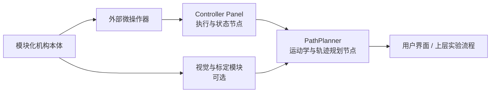

# 模块化闭环微操作系统项目总览

## 1. 文档定位

这份文档用于快速介绍整个模块化机构项目的背景、目标、系统组成和控制链路。

它描述的是“整个模块化闭环微操作平台”，不只是当前这个 PathPlanner 仓库。

适用场景包括：

- 给新成员做项目背景介绍。
- 给外部协作者、论文合作者或 AI 助手提供统一上下文。
- 在进入具体仓库、具体模块、具体代码之前，先说明系统全貌。

如果需要详细源码解释，应分别参考：

- PathPlanner 的项目说明文档。
- Controller Panel 的项目说明文档。
- TCP 协议说明文档。

---

## 2. 超短版背景信息

如果只需要一段很短的背景说明，可以直接使用下面这版：

本项目是一套面向模块化无源闭环微操作机构的控制平台。机构由标准体素模块磁吸装配而成，本体无主动驱动，需要多台外部三自由度微操作器牵引挂载点，通过协同位移诱发机构内部被动关节转动，从而让末端执行器获得额外姿态自由度。软件上采用分布式架构：PathPlanner 负责基于 Simulink / Simscape 模型进行正逆运动学求解与轨迹生成，Controller Panel 负责真实微操作器的轨迹执行与状态回传，二者通过 TCP 协议协同工作。

---

## 3. 一段可直接复用的项目简介

本项目面向一种用于多自由度微操作任务的模块化闭环机构平台。机构由 1 立方厘米标准体素模块构成，模块可分为结构模块、关节模块等类型，并通过磁力快速装配成不同拓扑的无源机构。由于模块本身不带执行器，系统采用多台外部三自由度微操作器牵引机构上的挂载点，通过专门设计的协同位移轨迹，使闭环机构内部的被动关节产生联动旋转，从而让末端执行器获得超出单台驱动器原始平移自由度之外的附加姿态自由度。为支撑这一能力，系统构建了一套分布式控制架构：上层 PathPlanner 负责模块化机构的正逆运动学求解与轨迹生成，下层 Controller Panel 负责微操作器的轨迹执行与状态回传，二者通过 TCP 文本协议解耦通信，从而形成“机构建模 - 运动学解算 - 轨迹下发 - 物理执行 - 状态反馈”的完整控制链。

---

## 4. 项目要解决的核心问题

这个项目要解决的不是普通串联机械臂控制问题，而是“无源模块化闭环机构”的控制问题。

它的难点主要有四个：

1. 机构拓扑不是固定的，可以由不同模块快速重构。
2. 模块本身无动力，运动完全依赖外部驱动器牵引。
3. 驱动器本身通常只提供 XYZ 平移，但机构末端需要获得额外的旋转自由度。
4. 不同构型的正逆运动学很难都靠手工推导，因此必须引入可复用的建模与求解方法。

因此，这个项目的本质是一套“面向可重构闭环机构的模型驱动运动控制框架”。

---

## 5. 核心机械思想

整个平台的核心机械思想可以概括为三点：

### 5.1 机构是模块化的

- 所有机构都由标准体素模块拼装而成。
- 模块之间通过磁力连接，便于快速重构。
- 不同模块组合可以形成不同的闭环或混联机构。

### 5.2 机构是无源的

- 模块内部通常不集成主动驱动器。
- 真正的输入来自外部微操作器对挂载点的牵引。
- 机构本体更像一个可编程几何传动结构，而不是传统主动机器人本体。

### 5.3 自由度增强来自“协同牵引”

- 单台微操作器只负责平移。
- 多台微操作器在不同挂载点执行非同步位移。
- 这种不完全一致的牵引会在闭环机构内部诱发关节转动。
- 末端执行器因此获得新的姿态变化能力。

这就是该平台能够用多个低阶平移驱动器实现更高阶末端运动的根本原因。

---

## 6. 代表性系统案例

当前最典型的示例，是一个四自由度微操作系统：

- 两台三自由度微操作器作为外部驱动源。
- 中间装配一个带两个平行旋转关节的三连杆模块化单元。
- 末端执行器安装在中间连杆上。

在这个案例里：

- 如果两台驱动器做同步平移，机构末端主要表现为位置变化。
- 如果两台驱动器做带差异的协同位移，机构内部转动副会被动旋转。
- 末端执行器因此在位置变化之外获得额外姿态变化。

这是平台“通过闭环机构把外部平移输入转化为末端附加旋转自由度”的典型体现。

---

## 7. 系统总体组成

整个项目可以分为五个层面：



### 7.1 机构层

负责真实的模块化闭环机构本体，包括：

- 结构模块
- 关节模块
- 末端执行器模块
- 外部驱动器挂载点

### 7.2 驱动层

由多台外部微操作器组成。当前典型实现是多台三自由度平移微操作器。

### 7.3 执行控制层

对应 Controller Panel 项目。

它负责：

- 连接真实微操作器控制器。
- 接收轨迹点数据。
- 执行平滑连续运动。
- 返回控制器状态和位移信息。

### 7.4 运动学规划层

对应当前仓库 PathPlanner。

它负责：

- 求解模块化机构正运动学。
- 求解模块化机构逆运动学。
- 生成驱动器位移轨迹。
- 管理模型参数与轨迹数据。
- 通过 TCP 与 Controller Panel 通信。

### 7.5 感知与标定层

这部分当前不是主控制链路核心，但属于潜在的重要扩展方向，包括：

- 相机标定
- ArUco 标记识别
- 外部位姿测量
- 感知辅助校准

---

## 8. 软件架构思路

为了让系统能随着机构构型变化持续扩展，整个软件采用了“分布式解耦 + 模型驱动”的思路。

### 8.1 为什么要解耦成多个节点

因为不同功能的工程约束完全不同：

- PathPlanner 更适合用 MATLAB、Simulink、Simscape 做建模与运动学求解。
- Controller Panel 更适合用独立控制软件直接接管硬件执行与连续轨迹跟踪。

如果把两者强行塞进一个程序：

- 模型求解会和设备驱动紧耦合。
- 新机构模型接入会非常困难。
- 硬件联调和算法开发会互相拖累。

因此项目采用“上层规划、下层执行”的分层方式。

### 8.2 为什么要使用 TCP 文本协议

因为这种方式：

- 简单直观，便于联调。
- 跨语言、跨进程兼容性好。
- 易于扩展新的控制命令和状态回报。
- 适合当前这种以实验平台为核心、快速迭代的研发环境。

---

## 9. 两个关键软件节点

### 9.1 Controller Panel

Controller Panel 是面向真实微操作器硬件的执行节点。

它的主要职责是：

- 管理微操作器控制器连接。
- 解析来自 PathPlanner 的轨迹或运动命令。
- 执行绝对步进、路径缓存、PTP 或连续轨迹跟踪。
- 返回当前控制器状态与执行结果。

可以把它理解为“硬件运动执行器 + 设备通信网关”。

### 9.2 PathPlanner

PathPlanner 是面向模块化机构模型的运动学与路径规划节点。

它的主要职责是：

- 根据当前驱动器位置求出机构当前末端位姿。
- 根据目标末端位姿反解驱动器应走的轨迹。
- 借助 Simulink / Simscape Multibody 适配不同机构构型。
- 把求解结果打包后下发给 Controller Panel。

可以把它理解为“上层运动学大脑”。

---

## 10. 为什么使用 Simulink 和 Simscape Multibody

这个项目没有选择为每一种机构手工推导正逆运动学公式，而是采用物理建模方式。

原因很直接：

1. 模块化机构的拓扑会变，手工推导成本太高。
2. 闭环机构约束复杂，手工推导容易出错。
3. 通过 Simscape Multibody，可以把机构描述从“公式问题”转化为“模型连接问题”。
4. 一旦模型输入输出接口统一，就能把新机构快速接入现有软件框架。

因此，项目的核心竞争力之一，就是把不同模块化构型都映射到统一的 Simulink 模型求解流程上。

---

## 11. 典型控制链路

系统的典型运行流程如下：

1. 用户选择某种模块化机构构型及对应模型。
2. Controller Panel 返回当前多台微操作器的位置。
3. PathPlanner 调用正运动学模型，求出机构当前末端位姿。
4. 用户给定目标末端位姿。
5. PathPlanner 调用逆运动学模型，生成多台微操作器需要执行的位移轨迹。
6. PathPlanner 通过 TCP 将轨迹点发送给 Controller Panel。
7. Controller Panel 在物理硬件上平滑执行轨迹。
8. 控制器状态再回传给上层，构成下一轮更新依据。

这条链路可以简化表示为：

```text
当前驱动器位置 -> FK -> 当前机构位姿 -> 目标机构位姿 -> IK -> 驱动器轨迹 -> 控制器执行 -> 状态回传
```

---

## 12. 这个项目真正的核心价值

从工程视角看，项目的真正价值不只是“能控制一台设备”，而是建立了一套可迁移的方法论：

### 12.1 机构层面

它证明了无源模块化闭环机构可以通过外部驱动器协同牵引获得高阶末端运动能力。

### 12.2 建模层面

它把机构重构问题与运动学求解问题统一进了模型驱动框架，而不依赖每次重新手推公式。

### 12.3 软件层面

它把规划和执行拆成独立节点，使不同团队、不同技术栈可以分别演进。

### 12.4 平台层面

它不是单一机构的专用程序，而是一个面向“多种模块化机构构型”的实验与控制平台。

---

## 13. 当前项目边界

为了避免误解，这里明确几个当前阶段的边界：

- 当前最成熟的是“两台三自由度微操作器 + 一套闭环模块化机构”的控制链路。
- PathPlanner 当前核心关注的是运动学求解与轨迹生成，而不是高层任务规划。
- 视觉模块目前更偏辅助和实验用途，还不是主控制闭环的必需部分。
- 整个平台是面向研究和快速迭代的架构，因此保留了较强的扩展空间。

---

## 14. 后续扩展方向

从架构上看，这个平台天然适合继续向几个方向扩展：

1. 支持更多模块化机构拓扑和更多自由度组合。
2. 支持超过两台驱动器协同牵引。
3. 引入更完整的视觉反馈与在线校准能力。
4. 引入更高层的任务规划、约束规划和安全策略。
5. 将当前实验型 TCP 接口继续标准化，形成更稳定的跨节点控制协议。

---

## 15. 总结

整个模块化机构项目的本质，是一套围绕“无源模块化闭环机构”建立起来的多层控制平台。

它通过：

- 模块化机构设计
- 外部驱动器协同牵引
- 基于 Simulink / Simscape 的模型求解
- PathPlanner 与 Controller Panel 的分布式解耦

共同实现了从机构构型描述到物理连续运动执行的完整链路。

如果要用一句话概括这个项目，可以表述为：

**这是一个面向可重构无源闭环微操作机构的模型驱动控制平台，其目标是用多台低阶平移驱动器，通过协同牵引与运动学规划，为机构末端生成更高阶的位置与姿态控制能力。**